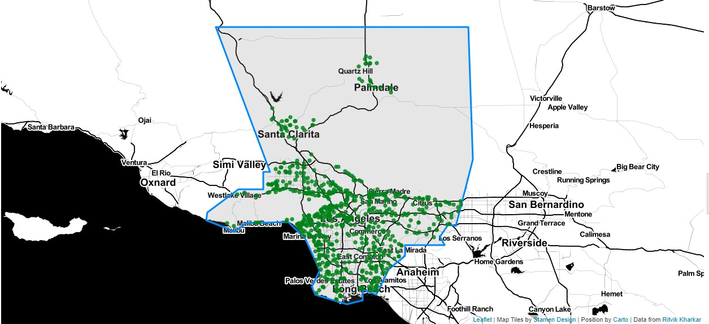
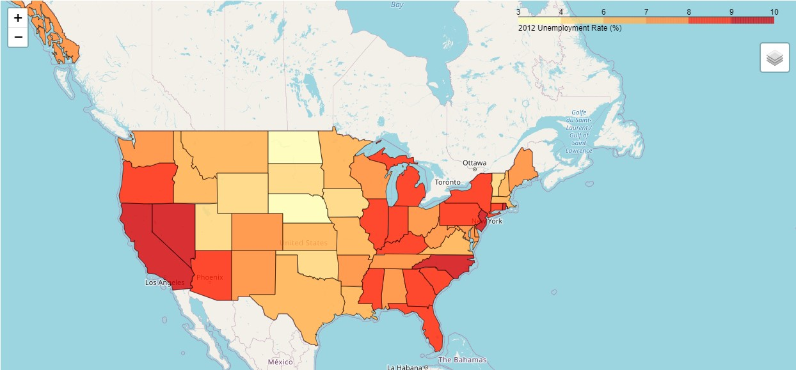

# Interactive Maps with Folium!

This repo contains a .ipynb file that has three sets of code to produce three interactive webmaps.  The first two concern Starbucks locations in LA county.  One is a choropleth of the count of Starbucks stores within zipcode in LA and the other displays point locations of all store locations in LA.  The last map is a choropleth of unemployment rates for all U.S. States.  This script utilizes the pandas and json libraries for data organization and the folium library for map visualization.

### Data

For the first two maps of Starbucks locations in LA county, a .geojson of the LA county boundary and a .geojson of LA zipcodes polygons as well as a .csv file of Starbucks locations is used.  In the last map, data was access from the [Folium Github data repo](https://github.com/python-visualization/folium/tree/master/examples/data).

## Map 1: Choropleth of Starbucks location counts in LA zipcodes

1.  The LA county .geojson, zipcode .geojson, and .csv of Starbucks locations are imported.
2.  The folium, pandas, and json libraries are imported.
3.  The Starbucks locations are opened as a dataframe and LA county is loaded.
4.  The store location dataframe is grouped by zipcode and stores are counted.  A new dataframe is created to hold zipcode and store count information.
5.  A map is then created by displaying zipcode polygons geojson and linking the number of stores based on the zipcode attribute.
6.  The interactive map is then given symbology and displayed.

The following is a screen capture of the webmap:

## Map 2: Point locations of Starbucks stores in LA county

1.  The LA county boundary geojson is added to the map.
2.  For each row within the Starbucks dataframe, the latitude and longitude are assigned to a point marker.  Symbology is chosen for the point markers.
3.  The interactive map is displayed.

The following is a screen capture of the webmap:
  

### Map 3: Choropleth of 2012 unemployment rates for U.S. States

1.  The url of the github data folder containing a U.S. States .json and a 2012 State unemployment .csv is assigned to a variable and these datafiles are opened.  The .csv is read as a dataframe and assigned to a variable.
2.  A map is initialized and then a choropleth is created by displaying the U.S. States .json and linking the unemployment dataframe using the 'State' field in the dataframe and the ID in the .json.  Symbology is chosen for the choropleth layer.
3.  The interactive map is then displayed.

The following is a screen capture of the webmap:

### Discussion

The most valuable information that I learned through this tutorial was how the geographic information GeoJSON files can be linked to Pandas dataframes in order to display tabular data within polygons.  With this course being the first time being exposed to the programming side of GIS, I found it useful to understand how python libraries that use geographic information are able to interact with each other to display information.  

I also found the discussion about the appropriate geographic shapes to use to aggregate points interesting.  I feel that in the case of Starbucks locations, aggregating to zip codes misrepresented the data, but also simply displaying the point data was difficult to interpret.  To display this information in a meaningful way, a point density map or aggregating to city blocks or census tracts would be effective.  Moving forward, I would like to research how to perform a point density analysis using python libraries.  

